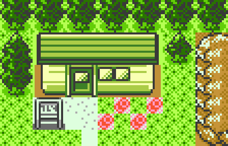

### Hi there, I'm Niko 👋

<!--
**nikouu/nikouu** is a ✨ _special_ ✨ repository because its `README.md` (this file) appears on your GitHub profile.

Here are some ideas to get you started:

- 🔭 I’m currently working on ...
- 🌱 I’m currently learning ...
- 👯 I’m looking to collaborate on ...
- 🤔 I’m looking for help with ...
- 💬 Ask me about ...
- 📫 How to reach me: ...
- 😄 Pronouns: ...
- ⚡ Fun fact: ...
-->

- 🔭 I’m currently working on little fascinating projects
- 🌱 I’m currently learning how to shift the [smallest number of bytes](https://github.com/nikouu/TinyWordle) the [fastest way possible](https://github.com/nikouu/dotnet-optimization-cheatsheet)
- ✍ I blog at [nikouusitalo.com](https://www.nikouusitalo.com/)
- 📫 How to reach me: Check out my [about page](https://www.nikouusitalo.com/about/)
- 😄 Pronouns: He/Him
- 🌏 Country: From :finland: Finland but in :new_zealand: New Zealand 
- ⚡ Fun fact: [Pokémon still does it for me](https://www.nikouusitalo.com/blog/making-a-living-dex-part-1-a-lifelong-dream/)

✨ Enjoy rummaging through my assorted collection of trinkets, snippets, baubles, and projects ✨
